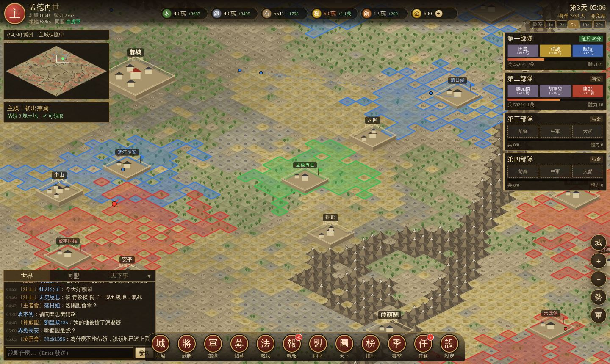
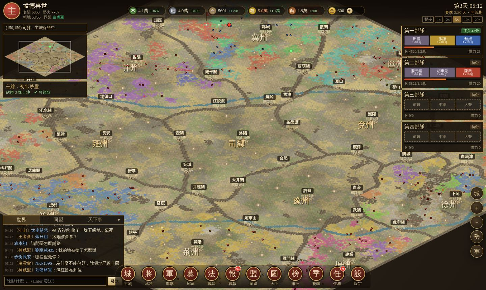
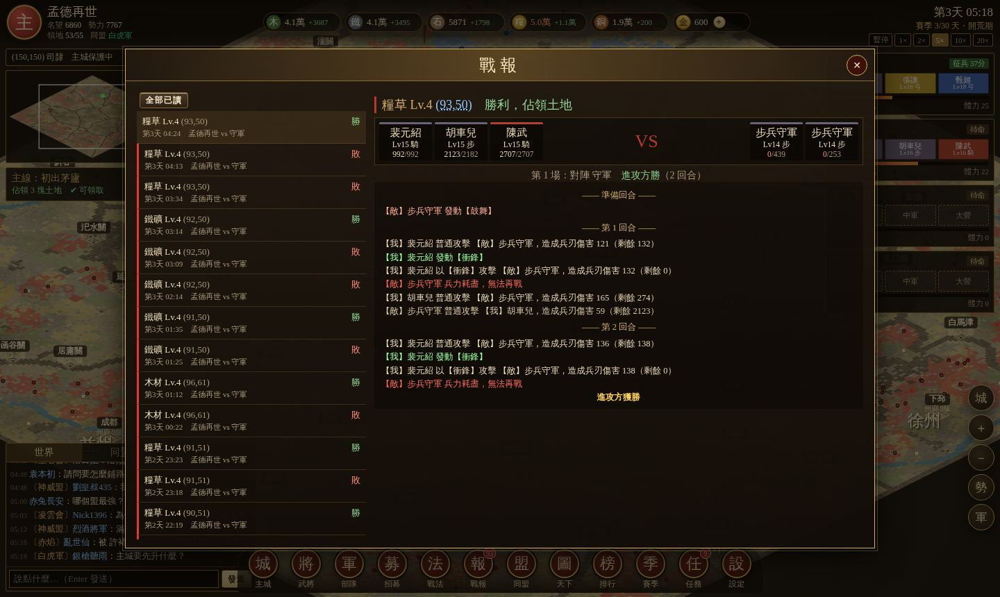
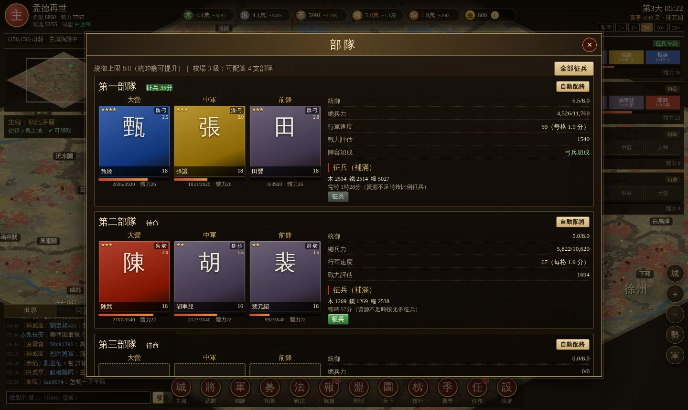

# 率土爭鋒 — 仿《率土之濱》的三國賽季制策略沙盤（單機 · 150 位 AI 主公）

以網頁實作的 SLG：經營主城、招募武將組隊、派兵佔領相鄰土地取得資源、升級建築與軍隊；加入同盟，與其他主公一起**鋪路、攻城、爭奪州府與洛陽**。遊戲採**賽季制**，每季以同盟爭霸為目標。

天下所有其他玩家都是 AI（預設 150 位），有**新手、休閒、普通、老手、課長**五種性格。**你在線時，所有 AI 同時行動**——開荒、組將、結盟、鋪路、攻城、搶地、報復、在頻道聊天，就像真人伺服器一樣；關閉或切走頁面時天下暫停並自動存檔。



| 天下勢力圖 | 戰報 | 部隊編成 |
|---|---|---|
|  |  |  |

## 如何開始

不需要安裝任何東西，純 HTML/JS（無建置步驟）：

- 直接用瀏覽器開啟 `index.html`；或
- 在專案目錄執行 `python3 -m http.server 8000`（或 `npx serve`），再開啟 <http://localhost:8000>

輸入主公名號、選擇出生州，按「開啟新賽季」。第一次會生成 300×300 格的天下（約 2 秒）。

### 操作

| 操作 | 方式 |
|---|---|
| 平移地圖 | 拖曳 / WASD / 方向鍵 |
| 縮放 | 滾輪 / 雙指 / 右側 ＋－ |
| 查看土地、出征、駐守、調動、放棄、建要塞 | 點擊地圖格子 |
| 回主城 | `H` 或右側「城」 |
| 暫停 / 速度 | 空白鍵；右上 1×/2×/5×/10×/20×（1× = 每真實秒 1 遊戲分鐘） |
| 勢力圖（依同盟上色）/ 隱藏他人行軍 | 右側「勢」「軍」 |

## 規則（參考率土之濱整理）

**資源與土地**
- 四種資源：木材、鐵礦、石料、糧草，另有銅幣（民居稅收）與金銖（招募用）。
- 土地 1~9 級，等級越高產量越高、守軍越強；6 級以上有兩隊守軍，需連續擊敗。
- 只能攻打**與自己或同盟領地相鄰**的土地；跨州必須經過**關口**。
- 領地數量受**名望**限制；首次佔領土地、升級建築會增加名望。領地滿了要放棄低級地換高級地。

**主城建築**：君王殿、伐木場、煉鐵場、採石場、農場、民居、倉庫、校場（部隊數）、兵營（帶兵上限）、募兵所（征兵速度）、統帥廳（統御上限）、城牆（主城耐久/城防），以及尚武營／鐵壁營／軍機營／疾風營（全武將屬性）。

**武將與部隊**
- 106 名三國武將，分漢、魏、蜀、吳、群五陣營與騎、步、弓三兵種，一～五星。其中 93 名採用**《率土之濱》官方武將庫數值（以台服為準，台服沒有的再用網易官網）**：陣營、星級、統御（cost）、兵種、攻擊距離、攻擊/防禦/謀略/速度/攻城與各項成長、自帶戰法與傳承戰法（如呂布「轅門射戟」、關羽「樊淵泅囚」、曹操「魏武之世」、諸葛亮「明其虛實」）；官方未收錄的武將（甄姬、臧霸、李傕、郭汜等與一星武將）沿用本作自訂數值。
- 每支部隊三人：**大營**（陣亡即敗）、**中軍**、**前鋒**，統御總和不可超過上限。三人同陣營、同兵種有額外加成。
- 兵種克制：騎克步、步克弓、弓克騎。
- 戰法分主動、被動、指揮、追擊，品質 S～D；官方戰法的發動機率、準備回合、傷害率/治療率、有效距離、兵種限制與說明文字皆取自台服戰法圖鑑（滿級數值）。武將 5 級開第二戰法欄、20 級開第三欄。可用**傳承**（消耗三星以上武將）取得其**傳承戰法**，同名武將可**進階**。
- 招募：名將卡包（金銖）、良將卡包（銅幣），五連抽保底四星。「儲值」為模擬功能，不需付費。

**戰鬥**：準備回合發動指揮/被動戰法，之後最多 8 回合，依速度（先攻優先）行動：主動戰法（機率、準備回合）→ 普通攻擊 → 追擊戰法。狀態有震懾、混亂、計窮、繳械、嘲諷、規避、洞察、灼燒、恐慌、休整、反擊、連擊等。8 回合未分勝負為平局。損失兵力需回主城征兵；出征消耗 20 體力，每小時恢復 20。

**同盟與攻城**
- 盟主設定目標城池，全盟**鋪路**（佔領通往城池的土地）；路通後**集結**，約定時間一起出兵。
- 攻城：先擊敗城池守軍（60 分鐘內沒攻下，守軍會恢復），再以兵力「攻城值」拆除耐久，歸零即佔領；耐久每小時恢復 2%。
- 城池種類：縣城、郡城、州府、關口、洛陽，提供同盟全員產量加成與賽季積分。
- 攻破其他玩家主城會使其**淪陷**，12 小時內上繳 20% 資源。

**賽季**：十三州（司隸居中，雍、兗、豫為資源州，涼、并、冀、幽、青、徐、揚、荊、益為出生州）。
- 第 1~3 天開荒（主城受保護）→ 第 4 天開放出生州關口 → 第 9 天開放司隸 → 第 15 天開放洛陽。
- **佔領洛陽並堅守 48 小時成就霸業**；否則第 30 天依同盟城池積分（縣10、關20、郡30、州府100、洛陽500）決定霸主。

## AI 主公

| 類型 | 行為特徵 |
|---|---|
| 新手 | 行動慢、常高估自己去打過高的地、忘記征兵與放棄低級地、配將隨便、頻道問問題 |
| 休閒 | 佛系種田，少打人 |
| 普通 | 一般發展，會入盟跟著鋪路 |
| 老手 | 決策快、建築順序最佳化、陣容搭配（陣營/兵種/前後排）、滿地時換地、建要塞前推、報復 |
| 課長 | 每天大量儲值抽卡、五星多、進階滿、侵略性強、常當盟主，會攻打弱小鄰居主城 |

每位 AI 都有獨立的技術、活躍度、侵略性與忠誠度。各州有 AI 盟主建盟、招人、邀請你入盟；同盟會自動選目標、計算繞開高級地的鋪路路線、定時集結攻城、失城後宣戰反攻。盟員會把部隊調動到前線的同盟城池或要塞駐紮，再從前線鋪路攻城。被打時會召回部隊、在盟頻道求援，盟友會派兵駐守；強勢玩家會「拔點」推進到弱小鄰居城下，攻陷其主城。

以 `node tests/sim.js 31` 無頭模擬一整季（150 AI）的典型結果：第 2 天出現第一批縣城易主，第 4 天後關口陸續被攻下、各州州府在第 5~10 天淪陷，司隸開放後各盟調兵到前線鋪路，約第 16~17 天有同盟攻下洛陽並堅守 48 小時成就霸業；全季約 80~90 座城池易主，並有主城淪陷事件。

## 專案結構

```
index.html         進入點
css/style.css      率土風格 UI
js/util.js         亂數、雜訊、格式化、AI 暱稱
js/data/*.js       規則常數、建築、武將、戰法、任務
js/world.js        十三州地圖生成（州界山脈、關口、城池、河流、土地等級）
js/battle.js       8 回合戰鬥引擎
js/core.js         遊戲狀態：資源、建築、武將、部隊、行軍、攻城、同盟、賽季、存檔
js/ai.js           AI 玩家與同盟 AI
js/chat.js         AI 聊天語料
js/render.js       等角地圖渲染與小地圖
js/ui.js           介面面板
js/main.js         主循環（在線即時運轉、離線暫停）
js/cardart.js      本機自用：執行時向官方網站載入武將卡圖（只有 index.html 引用）
tools/sync_official.py  從台服／網易官方武將庫同步武將與戰法數值
tests/             Node 無頭模擬與平衡校準
```

### 官網卡圖（本機自用）

在本機以瀏覽器執行 `index.html`（`file://`、`localhost` 或區網位址）時，武將卡面、部隊列表與戰報會**直接從《率土之濱》官方網站載入卡圖**（台服武將用台服圖鑑的 350×480 立繪與頭像，只有網易資料的武將用網易官網卡圖）；卡圖不存進 repo，也不會出現在嵌入版 `play.html`（不引用 `js/cardart.js`）。可在「設定 → 武將卡圖」關閉；離線或載入失敗時自動改用書法字卡面。

### 同步官方數值

```bash
pip install opencc-python-reimplemented
python3 tools/sync_official.py            # 抓台服 wjzl.js / jzzl.js 與網易 hero_extra.json / skill_extra.json，重寫 js/data/heroes.js 與 skills.js 的官方區塊
python3 tools/sync_official.py --report   # 另列出每名武將對應的官方版本與每個戰法的解析結果
```

官方戰法說明是自然語言，工具會解析傷害率、治療率、屬性增減、增減傷、控制與持續傷害等效果成戰鬥引擎的格式；條件式或疊層機制以近似效果表示（說明文字保留官方原文）。

### 測試

```bash
node tests/smoke.js          # 資料完整性 + 生成天下
node tests/sim.js 10         # 無頭模擬 10 個遊戲日（含存讀檔），輸出各類型 AI 發展統計
node tests/calibrate.js      # 隊伍戰力對守軍勝率校準
```

## 參考資料

規則參考下列網路資料整理；武將與戰法數值取自台服武將／戰法圖鑑（`wjzl.js`、`jzzl.js`），台服沒有的再用網易官網武將庫（`hero_extra.json`、`skill_extra.json`）：

- [《率土之濱》新手指南（官網）](https://stzb.163.com/zt/xinshou/)
- [率土之濱武將圖鑑（台服）](https://stzb.gamedreamer.com.tw/plate.html)、[戰法圖鑑（台服）](https://stzb.gamedreamer.com.tw/skill.html)
- [率土之濱武將庫（網易官網）](https://stzb.163.com/card_list.html)
- [率土之濱各等級土地守軍兵力 — 3DM手遊](https://shouyou.3dmgame.com/gl/62700.html)
- [率土之濱九級地守軍 — 小米遊戲中心](https://game.xiaomi.com/viewpoint/1098803155_1584518893206_13)
- [外王而內聖：率土之濱內政之道（官網）](https://stzb.163.com/strategy/2015/10/29/20401_577250.html)
- [率土之濱傷害公式 — 大神](https://ds.163.com/article/675d4a0aa7a4f6270baefb6e/)
- [戰法槽排序與釋放順序（官網）](https://stzb.163.com/strategy/zfxq/2019/08/23/21006_829378.html)
- [率土之濱攻城與城池耐久說明（官網賽季）](https://stzb.163.com/m/zf/fhlcbc.html)
- [率土之濱地圖介紹（十三州）](https://m.bengku.com/sygl/353.html)

本作為愛好者自製的學習專案，與網易《率土之濱》無關。
